# JAVA 从零到企业级电商（服务端)_v1.0
## 1. 架构

### 1. 淘宝项目架构

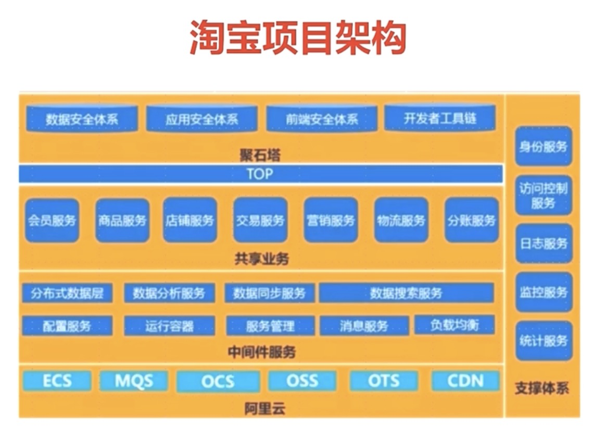

### 2. 服务器版本演进

- 单一服务器

  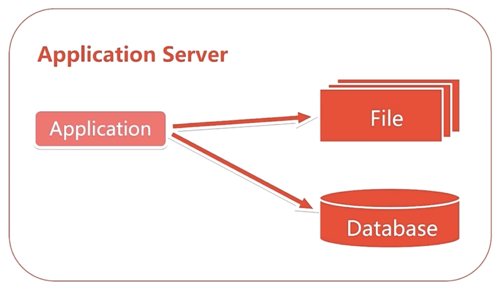

- 数据，应用服务器分离

  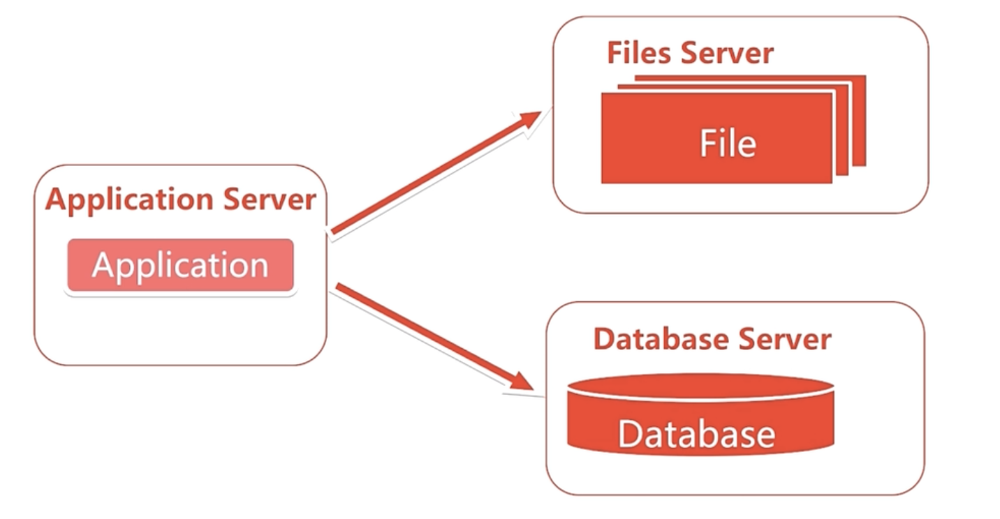

- 添加缓存

  - 分布式缓存
  - 本地缓存

  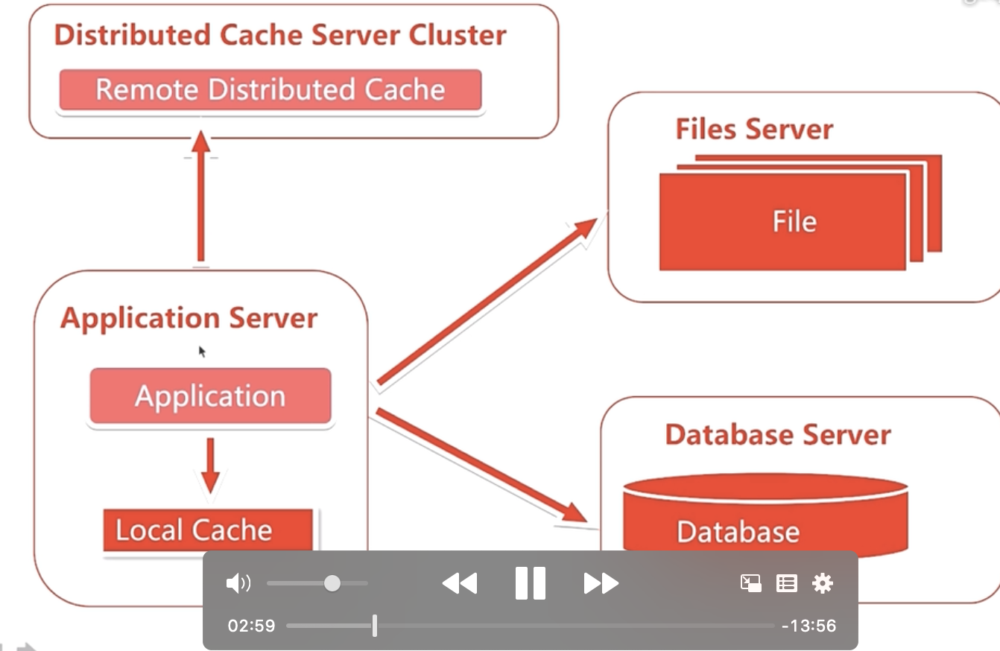

- 服务器集群

  使用多个服务器，使用 负载均衡

  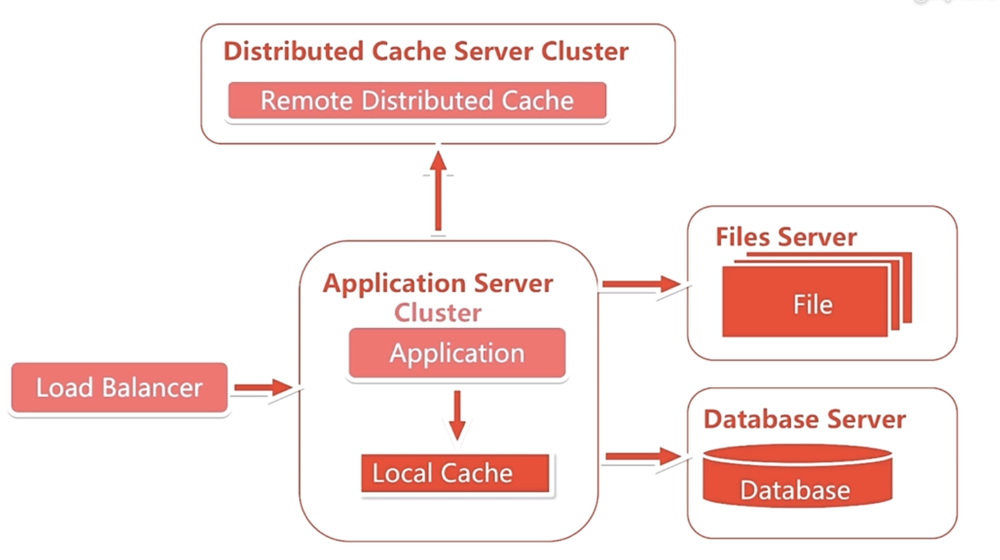

- 数据库读写分离

  1. 读在从库，写在主库
  2. 实现 data access module 模块，感知不到底层的读写分离（对业务没有侵入)

  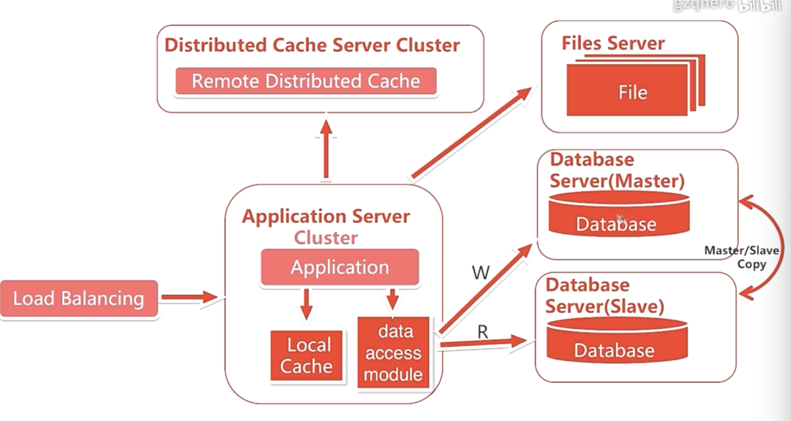

- 使用 CDN 和反向代理服务器

  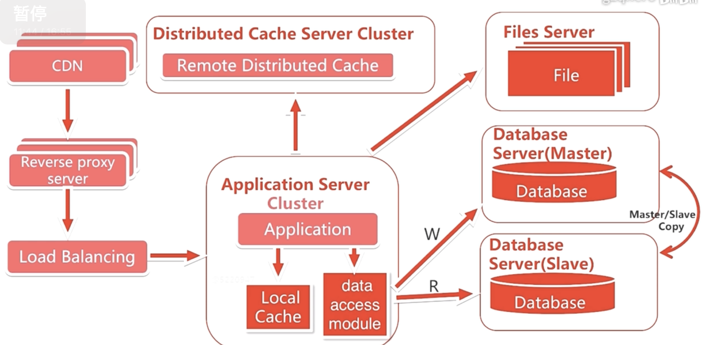

-  使用分布式文件服务器

  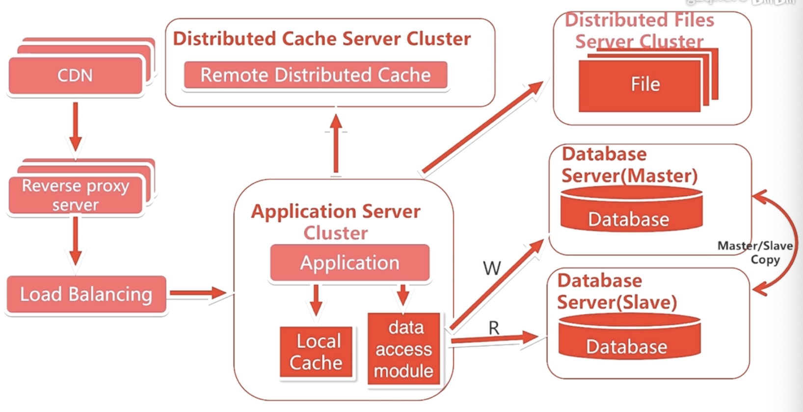

  
  
- 使用专库专用

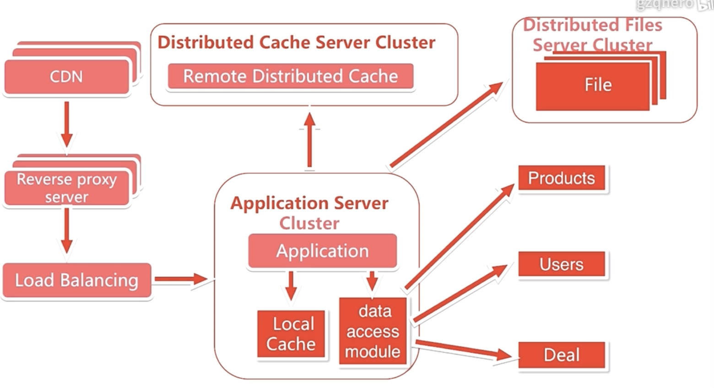

- 数据库水平拆分

  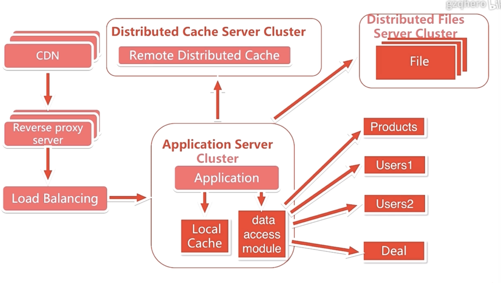

- 搜索功能抽取一个搜索引擎

   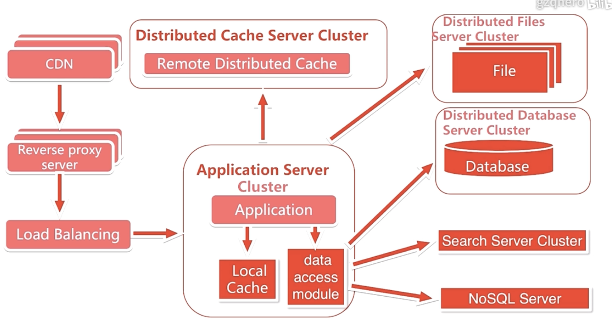


==> 高大上的技术架构都不是一蹴而就的

## 2. 环境安装

### 1. vsftpd

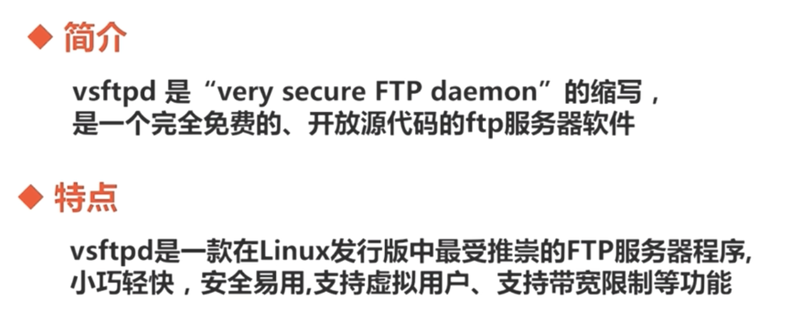

- 安装

  Docker 方式进行安装

  注意: 使用 /Users/ios/15_nginx 目录，如果用户为 file, 则 图片保存路径为 
  
   /Users/ios/15_nginx/file/xxx.jpg
  
  ==》只要 nginx 中 静态文件夹也使用 /Users/ios/15_nginx/file/ 就可以实现  ftp上传，拼接 url后，使用 nginx 进行显示
  
  ```
  docker pull fauria/vsftpd
  
  docker run -d 
  -v /Users/ios/15_nginx:/home/vsftpd 
  -p 20:20 -p 21:21 
  -p  21100-21110:21100-21110 
  -e FTP_USER=file 
  -e FTP_PASS=test 
  -e PASV_ADDRESS=127.0.0.1 
  -e PASV_MIN_PORT=21100 
  -e PASV_MAX_PORT=21110 
  --name vsftpd 
  --restart=always fauria/vsftpd
  ```

### 2. Nginx


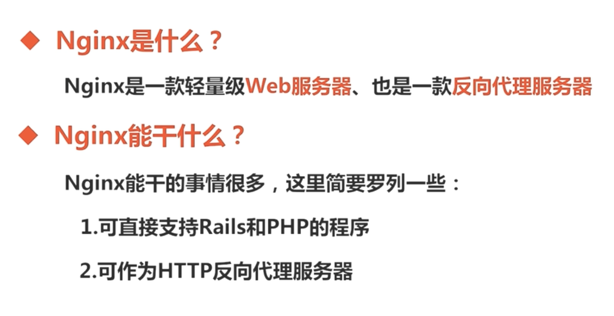

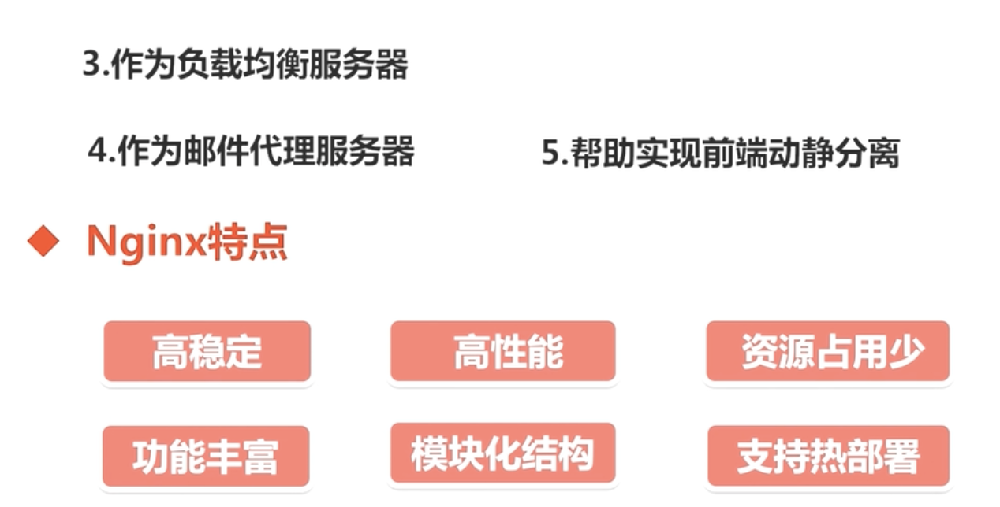

- docker安装nginx

```
docker pull nginx:latest
```

- 启动临时 nginx（用来拷贝配置文件)

```
docker run --name tmp-nginx -d nginx
```

- 从docker拷贝出nginx的配置文件

```
docker cp tmp-nginx:/etc/nginx/nginx.conf /Users/ios/15_nginx/nginx.conf

docker cp tmp-nginx:/etc/nginx/conf.d/default.conf /Users/ios/15_nginx/conf.d/default.conf
```

- 删除 nginx 容器

```
docker rm -f tmp-nginx
```

- 创建 本地 nginx 目录结构

```
- 15_nginx
	- conf.d    // nginx 的自定义配置文件
		- default.conf
	- file      // 图片文件目录（用作图片服务器)
	- log       // 挂载 nginx 的日志
	- nginx.conf // nginx 的 配置文件
	- www        // 用来放置前端工程
```

- default.conf 文件内容

  其中 www.day.com 为 在 /etc/hosts 中配置的 127.0.0.1 地址

  location 中 root 指定 的是 docker 中 nginx 的目录（挂载到本地即可)

```conf
server {
    listen       80;
    server_name  www.day.com;

    #charset koi8-r;
    #access_log  /var/log/nginx/host.access.log  main;

    location / {
	#proxy_pass http://127.0.0.1:8080;
	#add_header Access-Control-Allow-Origin *;
        root   /home/file;
        index  index.html index.htm;
    }
    ...
}
```

- 启动 nginx 容器

  其中 -v /Users/ios/15_nginx/file:/home/file 是用来挂载 本地目录到 docker中的 /home/file 目录

```
docker run --name nginx -p 80:80 
-v /Users/ios/15_nginx/nginx.conf:/etc/nginx/nginx.conf 
-v /Users/ios/15_nginx/conf.d:/etc/nginx/conf.d 
-v /Users/ios/15_nginx/www:/www  
-v /Users/ios/15_nginx/log/:/var/log/nginx  
-v /Users/ios/15_nginx/file:/home/file 
-d nginx
```

- 测试

  在 /Users/ios/15_nginx/file 目录下放置一个文件 1.jpg，从浏览器输入 www.day.com/1.jpg 访问即可

## 3. 表结构

### 1. 用户表

```sql
DROP TABLE IF EXISTS `mmall_user`;
CREATE TABLE `mmall_user` (
  `id` int(11) NOT NULL AUTO_INCREMENT COMMENT '用户表id',
  `username` varchar(50) NOT NULL COMMENT '用户名',
  `password` varchar(50) NOT NULL COMMENT '用户密码，MD5加密',
  `email` varchar(50) DEFAULT NULL,
  `phone` varchar(20) DEFAULT NULL,
  `question` varchar(100) DEFAULT NULL COMMENT '找回密码问题',
  `answer` varchar(100) DEFAULT NULL COMMENT '找回密码答案',
  `role` int(4) NOT NULL COMMENT '角色0-管理员,1-普通用户',
  `create_time` datetime NOT NULL COMMENT '创建时间',
  `update_time` datetime NOT NULL COMMENT '最后一次更新时间',
  PRIMARY KEY (`id`),
  UNIQUE KEY `user_name_unique` (`username`) USING BTREE
) ENGINE=InnoDB AUTO_INCREMENT=22 DEFAULT CHARSET=utf8;
```

### 2. 分类表

```sql
DROP TABLE IF EXISTS `mmall_category`;
CREATE TABLE `mmall_category` (
  `id` int(11) NOT NULL AUTO_INCREMENT COMMENT '类别Id',
  `parent_id` int(11) DEFAULT NULL COMMENT '父类别id当id=0时说明是根节点,一级类别',
  `name` varchar(50) DEFAULT NULL COMMENT '类别名称',
  `status` tinyint(1) DEFAULT '1' COMMENT '类别状态1-正常,2-已废弃',
  `sort_order` int(4) DEFAULT NULL COMMENT '排序编号,同类展示顺序,数值相等则自然排序',
  `create_time` datetime DEFAULT NULL COMMENT '创建时间',
  `update_time` datetime DEFAULT NULL COMMENT '更新时间',
  PRIMARY KEY (`id`)
) ENGINE=InnoDB AUTO_INCREMENT=100032 DEFAULT CHARSET=utf8;
```

### 3. 产品表

```sql
DROP TABLE IF EXISTS `mmall_product`;
CREATE TABLE `mmall_product` (
  `id` int(11) NOT NULL AUTO_INCREMENT COMMENT '商品id',
  `category_id` int(11) NOT NULL COMMENT '分类id,对应mmall_category表的主键',
  `name` varchar(100) NOT NULL COMMENT '商品名称',
  `subtitle` varchar(200) DEFAULT NULL COMMENT '商品副标题',
  `main_image` varchar(500) DEFAULT NULL COMMENT '产品主图,url相对地址',
  `sub_images` text COMMENT '图片地址,json格式,扩展用',
  `detail` text COMMENT '商品详情',
  `price` decimal(20,2) NOT NULL COMMENT '价格,单位-元保留两位小数',
  `stock` int(11) NOT NULL COMMENT '库存数量',
  `status` int(6) DEFAULT '1' COMMENT '商品状态.1-在售 2-下架 3-删除',
  `create_time` datetime DEFAULT NULL COMMENT '创建时间',
  `update_time` datetime DEFAULT NULL COMMENT '更新时间',
  PRIMARY KEY (`id`)
) ENGINE=InnoDB AUTO_INCREMENT=30 DEFAULT CHARSET=utf8;
```

### 4. 购物车表

```sql
DROP TABLE IF EXISTS `mmall_cart`;
CREATE TABLE `mmall_cart` (
  `id` int(11) NOT NULL AUTO_INCREMENT,
  `user_id` int(11) NOT NULL,
  `product_id` int(11) DEFAULT NULL COMMENT '商品id',
  `quantity` int(11) DEFAULT NULL COMMENT '数量',
  `checked` int(11) DEFAULT NULL COMMENT '是否选择,1=已勾选,0=未勾选',
  `create_time` datetime DEFAULT NULL COMMENT '创建时间',
  `update_time` datetime DEFAULT NULL COMMENT '更新时间',
  PRIMARY KEY (`id`),
  KEY `user_id_index` (`user_id`) USING BTREE
) ENGINE=InnoDB AUTO_INCREMENT=146 DEFAULT CHARSET=utf8;
```

### 5. 支付信息表

```sql
DROP TABLE IF EXISTS `mmall_pay_info`;
CREATE TABLE `mmall_pay_info` (
  `id` int(11) NOT NULL AUTO_INCREMENT,
  `user_id` int(11) DEFAULT NULL COMMENT '用户id',
  `order_no` bigint(20) DEFAULT NULL COMMENT '订单号',
  `pay_platform` int(10) DEFAULT NULL COMMENT '支付平台:1-支付宝,2-微信',
  `platform_number` varchar(200) DEFAULT NULL COMMENT '支付宝支付流水号',
  `platform_status` varchar(20) DEFAULT NULL COMMENT '支付宝支付状态',
  `create_time` datetime DEFAULT NULL COMMENT '创建时间',
  `update_time` datetime DEFAULT NULL COMMENT '更新时间',
  PRIMARY KEY (`id`)
) ENGINE=InnoDB AUTO_INCREMENT=61 DEFAULT CHARSET=utf8;
```

### 6. 订单表

```sql
DROP TABLE IF EXISTS `mmall_order`;
CREATE TABLE `mmall_order` (
  `id` int(11) NOT NULL AUTO_INCREMENT COMMENT '订单id',
  `order_no` bigint(20) DEFAULT NULL COMMENT '订单号',
  `user_id` int(11) DEFAULT NULL COMMENT '用户id',
  `shipping_id` int(11) DEFAULT NULL,
  `payment` decimal(20,2) DEFAULT NULL COMMENT '实际付款金额,单位是元,保留两位小数',
  `payment_type` int(4) DEFAULT NULL COMMENT '支付类型,1-在线支付',
  `postage` int(10) DEFAULT NULL COMMENT '运费,单位是元',
  ` status` int(10) DEFAULT NULL COMMENT '订单状态:0-已取消-10-未付款，20-已付款，40-已发货，50-交易成功，60-交易关闭',
  `payment_time` datetime DEFAULT NULL COMMENT '支付时间',
  `send_time` datetime DEFAULT NULL COMMENT '发货时间',
  `end_time` datetime DEFAULT NULL COMMENT '交易完成时间',
  `close_time` datetime DEFAULT NULL COMMENT '交易关闭时间',
  `create_time` datetime DEFAULT NULL COMMENT '创建时间',
  `update_time` datetime DEFAULT NULL COMMENT '更新时间',
  PRIMARY KEY (`id`),
  UNIQUE KEY `order_no_index` (`order_no`) USING BTREE
) ENGINE=InnoDB AUTO_INCREMENT=118 DEFAULT CHARSET=utf8;
```

### 7. 订单明细表

```sql
DROP TABLE IF EXISTS `mmall_order_item`;
CREATE TABLE `mmall_order_item` (
  `id` int(11) NOT NULL AUTO_INCREMENT COMMENT '订单子表id',
  `user_id` int(11) DEFAULT NULL,
  `order_no` bigint(20) DEFAULT NULL,
  `product_id` int(11) DEFAULT NULL COMMENT '商品id',
  `product_name` varchar(100) DEFAULT NULL COMMENT '商品名称',
  `product_image` varchar(500) DEFAULT NULL COMMENT '商品图片地址',
  `current_unit_price` decimal(20,2) DEFAULT NULL COMMENT '生成订单时的商品单价，单位是元,保留两位小数',
  `quantity` int(10) DEFAULT NULL COMMENT '商品数量',
  `total_price` decimal(20,2) DEFAULT NULL COMMENT '商品总价,单位是元,保留两位小数',
  `create_time` datetime DEFAULT NULL,
  `update_time` datetime DEFAULT NULL,
  PRIMARY KEY (`id`),
  KEY `order_no_index` (`order_no`) USING BTREE,
  KEY `order_no_user_id_index` (`user_id`,`order_no`) USING BTREE
) ENGINE=InnoDB AUTO_INCREMENT=135 DEFAULT CHARSET=utf8;
```

### 8. 收货地址表

```sql
DROP TABLE IF EXISTS `mmall_shipping`;
CREATE TABLE `mmall_shipping` (
  `id` int(11) NOT NULL AUTO_INCREMENT,
  `user_id` int(11) DEFAULT NULL COMMENT '用户id',
  `receiver_name` varchar(20) DEFAULT NULL COMMENT '收货姓名',
  `receiver_phone` varchar(20) DEFAULT NULL COMMENT '收货固定电话',
  `receiver_mobile` varchar(20) DEFAULT NULL COMMENT '收货移动电话',
  `receiver_province` varchar(20) DEFAULT NULL COMMENT '省份',
  `receiver_city` varchar(20) DEFAULT NULL COMMENT '城市',
  `receiver_district` varchar(20) DEFAULT NULL COMMENT '区/县',
  `receiver_address` varchar(200) DEFAULT NULL COMMENT '详细地址',
  `receiver_zip` varchar(6) DEFAULT NULL COMMENT '邮编',
  `create_time` datetime DEFAULT NULL,
  `update_time` datetime DEFAULT NULL,
  PRIMARY KEY (`id`)
) ENGINE=InnoDB AUTO_INCREMENT=33 DEFAULT CHARSET=utf8;
```

## 4. 项目搭建

### 1. 创建基本 maven 项目

1. 使用 maven  artchtype web-app进行创建

2. 项目创建完毕之后，补充完整文件夹

### 2. pom 添加依赖

### 3. 集成Spring

#### 1. 配置web.xml

##### 配置请求转码 utf-8 (使用 filter)

```xml
<!-- 将所有请求都转为 UTF_8 -->
    <filter>
        <filter-name>characterEncodingFilter</filter-name>
        <filter-class>org.springframework.web.filter.CharacterEncodingFilter</filter-class>
        <init-param>
            <param-name>encoding</param-name>
            <param-value>UTF-8</param-value>
        </init-param>
        <init-param>
            <param-name>forceEncoding</param-name>
            <param-value>true</param-value>
        </init-param>
    </filter>
    <filter-mapping>
        <filter-name>characterEncodingFilter</filter-name>
        <url-pattern>/*</url-pattern>
    </filter-mapping>
```

##### 配置 Web容器 监听器

```xml
<listener>
  <listener-class>org.springframework.web.context.request.RequestContextListener</listener-class>
    </listener>
```

##### 配置 Web容器与 Spring容器整合的监听器

```
<listener>
        <listener-class>org.springframework.web.context.ContextLoaderListener</listener-class>
    </listener>
```

##### 指定 Spring 的配置文件

```xml
 <context-param>
        <param-name>contextConfigLocation</param-name>
        <param-value>
            classpath:applicationContext.xml
        </param-value>
    </context-param>
```

##### 配置 SpringMVC 拦截的请求

```
 <!-- *.do 的请求，都会被 SpringMVC 进行拦截 -->
    <servlet>
        <servlet-name>dispatcher</servlet-name>
        <servlet-class>org.springframework.web.servlet.DispatcherServlet</servlet-class>
        <!-- 默认的 servlet 对应的 xml 文件名称为 servlet名称-servlet.xml
            在此处即 dispatcher-servlet.xml (在 WEB-INFO 下)
            如果需要更改名称，可以使用
            <init-param>
                <param-name>contextConfigLocation</param-name>
                <param-value>/WEB-INF/想要的.xml</param-value>
            </init-param>
        -->
        <load-on-startup>1</load-on-startup>
    </servlet>
    <servlet-mapping>
        <servlet-name>dispatcher</servlet-name>
        <url-pattern>*.do</url-pattern>
    </servlet-mapping>
```

#### 2. 配置 Spring 配置文件

- 扫描包
- 开启aop
- 加载另外的配置文件

```
		<!-- 扫描 com.mmall 包下的注解 -->
    <context:component-scan base-package="com.mmall" annotation-config="true"/>

    <!--<context:annotation-config/>-->
    <!-- aop 的配置 -->
    <aop:aspectj-autoproxy/>

    <!-- 加载另外的配置文件 (将配置放在多个 xml 配置文件中 )-->
    <import resource="applicationContext-datasource.xml"/>
```

- 创建property bean, 读取 properties中配置项

```xml
<bean id="propertyConfigurer"
          class="org.springframework.beans.factory.config.PropertyPlaceholderConfigurer">
        <property name="order" value="2"/>
        <property name="ignoreUnresolvablePlaceholders" value="true"/>
        <property name="locations">
            <list>
                <value>classpath:datasource.properties</value>
            </list>
        </property>
        <property name="fileEncoding" value="utf-8"/>
    </bean>
```

- 配置连接池

```xml
<!-- 连接池的配置 -->
    <bean id="dataSource" class="org.apache.commons.dbcp.BasicDataSource" destroy-method="close">
        <property name="driverClassName" value="${db.driverClassName}"/>
        <property name="url" value="${db.url}"/>
        <property name="username" value="${db.username}"/>
        <property name="password" value="${db.password}"/>
        <!-- 连接池启动时的初始值 -->
        <property name="initialSize" value="${db.initialSize}"/>
        <!-- 连接池的最大值 -->
        <property name="maxActive" value="${db.maxActive}"/>
        <!-- 最大空闲值.当经过一个高峰时间后，连接池可以慢慢将已经用不到的连接慢慢释放一部分，一直减少到maxIdle为止 -->
        <property name="maxIdle" value="${db.maxIdle}"/>
        <!-- 最小空闲值.当空闲的连接数少于阀值时，连接池就会预申请去一些连接，以免洪峰来时来不及申请 -->
        <property name="minIdle" value="${db.minIdle}"/>
        <!-- 最大建立连接等待时间。如果超过此时间将接到异常。设为－1表示无限制 -->
        <property name="maxWait" value="${db.maxWait}"/>
        <!--#给出一条简单的sql语句进行验证 -->
         <!--<property name="validationQuery" value="select getdate()" />-->
        <property name="defaultAutoCommit" value="${db.defaultAutoCommit}"/>
        <!-- 回收被遗弃的（一般是忘了释放的）数据库连接到连接池中 -->
         <!--<property name="removeAbandoned" value="true" />-->
        <!-- 数据库连接过多长时间不用将被视为被遗弃而收回连接池中 -->
         <!--<property name="removeAbandonedTimeout" value="120" />-->
        <!-- #连接的超时时间，默认为半小时。 -->
        <property name="minEvictableIdleTimeMillis" value="${db.minEvictableIdleTimeMillis}"/>

        <!--# 失效检查线程运行时间间隔，要小于MySQL默认-->
        <property name="timeBetweenEvictionRunsMillis" value="40000"/>
        <!--# 检查连接是否有效-->
        <property name="testWhileIdle" value="true"/>
        <!--# 检查连接有效性的SQL语句-->
        <property name="validationQuery" value="SELECT 1 FROM dual"/>
    </bean>
```

- 配置 mybatis  (指定分页插件)

```xml
<!-- mybatis 的 sqlSessionFactory 的配置 -->
    <bean id="sqlSessionFactory" class="org.mybatis.spring.SqlSessionFactoryBean">
        <!-- 指定数据源 -->
        <property name="dataSource" ref="dataSource"/>
        <!-- 指定 mapper xml 文件 -->
        <property name="mapperLocations" value="classpath*:mappers/*Mapper.xml"></property>

        <!-- 指定 分页插件 -->
        <property name="plugins">
            <array>
                <bean class="com.github.pagehelper.PageHelper">
                    <property name="properties">
                        <value>
                            dialect=mysql
                        </value>
                    </property>
                </bean>
            </array>
        </property>

    </bean>


<!-- 配置mybatis dao 层扫描 -->
    <bean name="mapperScannerConfigurer" class="org.mybatis.spring.mapper.MapperScannerConfigurer">
        <property name="basePackage" value="com.mmall.dao"/>
    </bean>
```

- 事务配置

```xml
<!-- 使用@Transactional进行声明式事务管理需要声明下面这行 -->
    <tx:annotation-driven transaction-manager="transactionManager" proxy-target-class="true" />
    <!-- 事务管理 -->
    <bean id="transactionManager" class="org.springframework.jdbc.datasource.DataSourceTransactionManager">
        <property name="dataSource" ref="dataSource"/>
        <property name="rollbackOnCommitFailure" value="true"/>
    </bean>
```

#### 3. 配置 servlet.xml

- 包扫描
- springmvc json 转换
- 文件上传

```
<context:component-scan base-package="com.mmall" annotation-config="true"/>

    <mvc:annotation-driven>
        <mvc:message-converters>
            <bean class="org.springframework.http.converter.StringHttpMessageConverter">
                <property name="supportedMediaTypes">
                    <list>
                        <value>text/plain;charset=UTF-8</value>
                        <value>text/html;charset=UTF-8</value>
                    </list>
                </property>
            </bean>
            <bean class="org.springframework.http.converter.json.MappingJacksonHttpMessageConverter">
                <property name="supportedMediaTypes">
                    <list>
                        <value>application/json;charset=UTF-8</value>
                    </list>
                </property>
            </bean>
        </mvc:message-converters>
    </mvc:annotation-driven>


    <!-- 文件上传 -->
    <bean id="multipartResolver" class="org.springframework.web.multipart.commons.CommonsMultipartResolver">
        <property name="maxUploadSize" value="10485760"/> <!-- 10m -->
        <property name="maxInMemorySize" value="4096" />
        <property name="defaultEncoding" value="UTF-8"></property>
    </bean>
```


### 4. Mybatis-genator 生成 dao, pojo, mapper 等

## 5. Mybatis-genator

使用 mybatis-genator 插件，根据数据表，生成对应的 dao, pojo, mapper

### 1. 添加 mybatis-genator 依赖

在 pom 中，添加 plugin 插件

```
<build>
    <finalName>mmall</finalName>
    <plugins>

      <!-- 配置 mybatis generator 依赖 -->
      <plugin>
        <groupId>org.mybatis.generator</groupId>
        <artifactId>mybatis-generator-maven-plugin</artifactId>
        <version>1.3.2</version>
        <configuration>
          <verbose>true</verbose>
          <overwrite>true</overwrite>
        </configuration>
      </plugin>

```

### 2.在 resources 下，定义 generatorConfig.xml 文件

```xml
<?xml version="1.0" encoding="UTF-8"?>
<!DOCTYPE generatorConfiguration
        PUBLIC "-//mybatis.org//DTD MyBatis Generator Configuration 1.0//EN"
        "http://mybatis.org/dtd/mybatis-generator-config_1_0.dtd">

<generatorConfiguration>
    <!--导入属性配置-->
    <properties resource="datasource.properties"></properties>

    <!--指定特定数据库的jdbc驱动jar包的位置-->
    <classPathEntry location="${db.driverLocation}"/>

    <context id="default" targetRuntime="MyBatis3">

        <!-- optional，旨在创建class时，对注释进行控制 -->
        <commentGenerator>
            <property name="suppressDate" value="true"/>
            <property name="suppressAllComments" value="true"/>
        </commentGenerator>

        <!--jdbc的数据库连接 -->
        <jdbcConnection
                driverClass="${db.driverClassName}"
                connectionURL="${db.url}"
                userId="${db.username}"
                password="${db.password}">
        </jdbcConnection>


        <!-- 非必需，类型处理器，在数据库类型和java类型之间的转换控制-->
        <javaTypeResolver>
            <property name="forceBigDecimals" value="false"/>
        </javaTypeResolver>


        <!-- Model模型生成器,用来生成含有主键key的类，记录类 以及查询Example类
            targetPackage     指定生成的model生成所在的包名
            targetProject     指定在该项目下所在的路径
        -->
        <!--<javaModelGenerator targetPackage="com.mmall.pojo" targetProject=".\src\main\java">-->
        <javaModelGenerator targetPackage="com.mmall.pojo" targetProject="./src/main/java">
            <!-- 是否允许子包，即targetPackage.schemaName.tableName -->
            <property name="enableSubPackages" value="false"/>
            <!-- 是否对model添加 构造函数 -->
            <property name="constructorBased" value="true"/>
            <!-- 是否对类CHAR类型的列的数据进行trim操作 -->
            <property name="trimStrings" value="true"/>
            <!-- 建立的Model对象是否 不可改变  即生成的Model对象不会有 setter方法，只有构造方法 -->
            <property name="immutable" value="false"/>
        </javaModelGenerator>

        <!--mapper映射文件生成所在的目录 为每一个数据库的表生成对应的SqlMap文件 -->
        <!--<sqlMapGenerator targetPackage="mappers" targetProject=".\src\main\resources">-->
        <sqlMapGenerator targetPackage="mappers" targetProject="./src/main/resources">
            <property name="enableSubPackages" value="false"/>
        </sqlMapGenerator>

        <!-- 客户端代码，生成易于使用的针对Model对象和XML配置文件 的代码
                type="ANNOTATEDMAPPER",生成Java Model 和基于注解的Mapper对象
                type="MIXEDMAPPER",生成基于注解的Java Model 和相应的Mapper对象
                type="XMLMAPPER",生成SQLMap XML文件和独立的Mapper接口
        -->

        <!-- targetPackage：mapper接口dao生成的位置 -->
        <!--<javaClientGenerator type="XMLMAPPER" targetPackage="com.mmall.dao" targetProject=".\src\main\java">-->
        <javaClientGenerator type="XMLMAPPER" targetPackage="com.mmall.dao" targetProject="./src/main/java">
            <!-- enableSubPackages:是否让schema作为包的后缀 -->
            <property name="enableSubPackages" value="false" />
        </javaClientGenerator>


        <table tableName="mmall_shipping" domainObjectName="Shipping" enableCountByExample="false" enableUpdateByExample="false" enableDeleteByExample="false" enableSelectByExample="false" selectByExampleQueryId="false"></table>
        <table tableName="mmall_cart" domainObjectName="Cart" enableCountByExample="false" enableUpdateByExample="false" enableDeleteByExample="false" enableSelectByExample="false" selectByExampleQueryId="false"></table>
        <table tableName="mmall_cart_item" domainObjectName="CartItem" enableCountByExample="false" enableUpdateByExample="false" enableDeleteByExample="false" enableSelectByExample="false" selectByExampleQueryId="false"></table>
        <table tableName="mmall_category" domainObjectName="Category" enableCountByExample="false" enableUpdateByExample="false" enableDeleteByExample="false" enableSelectByExample="false" selectByExampleQueryId="false"></table>
        <table tableName="mmall_order" domainObjectName="Order" enableCountByExample="false" enableUpdateByExample="false" enableDeleteByExample="false" enableSelectByExample="false" selectByExampleQueryId="false"></table>
        <table tableName="mmall_order_item" domainObjectName="OrderItem" enableCountByExample="false" enableUpdateByExample="false" enableDeleteByExample="false" enableSelectByExample="false" selectByExampleQueryId="false"></table>
        <table tableName="mmall_pay_info" domainObjectName="PayInfo" enableCountByExample="false" enableUpdateByExample="false" enableDeleteByExample="false" enableSelectByExample="false" selectByExampleQueryId="false"></table>
        <table tableName="mmall_product" domainObjectName="Product" enableCountByExample="false" enableUpdateByExample="false" enableDeleteByExample="false" enableSelectByExample="false" selectByExampleQueryId="false">
            <columnOverride column="detail" jdbcType="VARCHAR" />
            <columnOverride column="sub_images" jdbcType="VARCHAR" />
        </table>
        <table tableName="mmall_user" domainObjectName="User" enableCountByExample="false" enableUpdateByExample="false" enableDeleteByExample="false" enableSelectByExample="false" selectByExampleQueryId="false"></table>


        <!-- geelynote mybatis插件的搭建 -->
    </context>
</generatorConfiguration>
```

### 3. 在 resources 下，添加 datasource.properties

```properties
db.driverLocation=/Users/ios/mysql-connector-java-5.1.6-bin.jar
db.driverClassName=com.mysql.jdbc.Driver

db.url=jdbc:mysql://127.0.0.1:3306/mmall?characterEncoding=utf-8
db.username=root
db.password=123456


db.initialSize = 20
db.maxActive = 50
db.maxIdle = 20
db.minIdle = 10
db.maxWait = 10
db.defaultAutoCommit = true
db.minEvictableIdleTimeMillis = 3600000

```

### 4. 根据xml配置，生成 dao, pojo, mapper

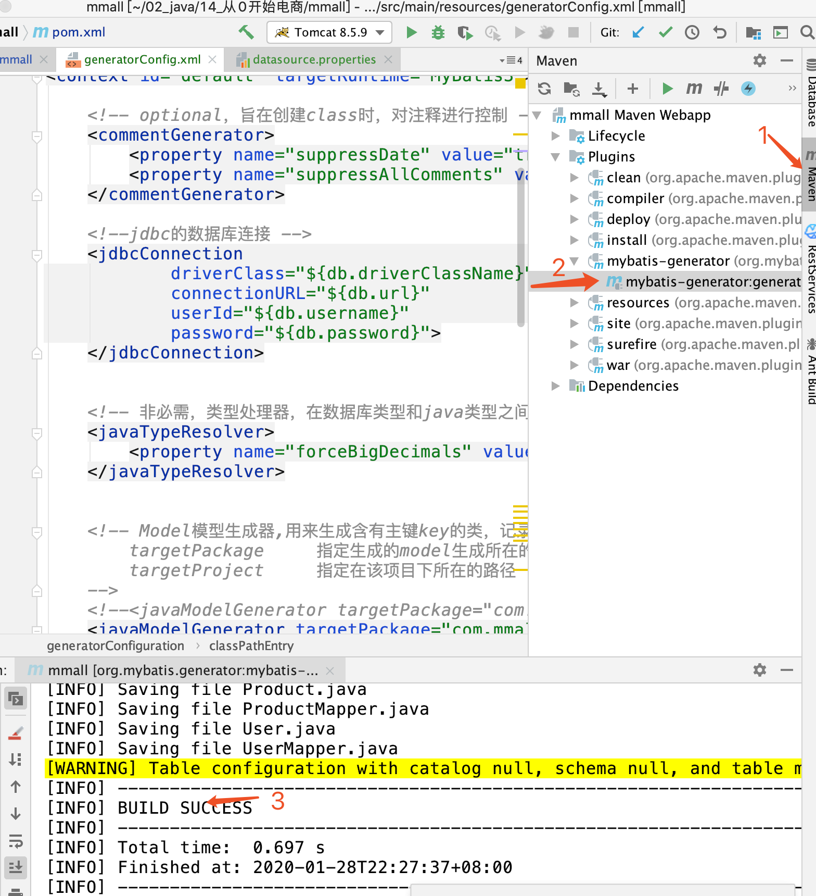

- 效果

  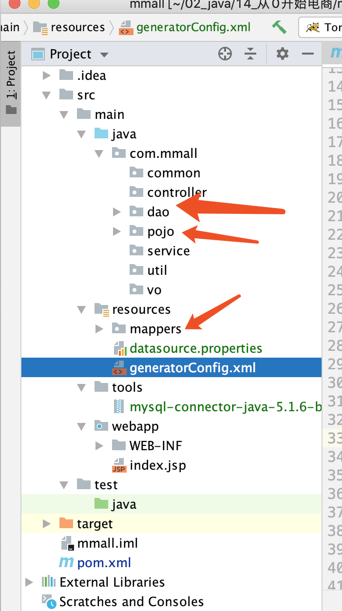

## 6. POJO BO VO

1. POJO 用来与数据库做交互
2. 请求数据，响应数据 用 VO做封装 （要什么，返回什么)
3. 如果 业务麻烦，可以在 service 层 新增一个 BO对象，对 POJO 做进一层的封装；如果简单，Service 层与 Controller 都使用 VO 即可

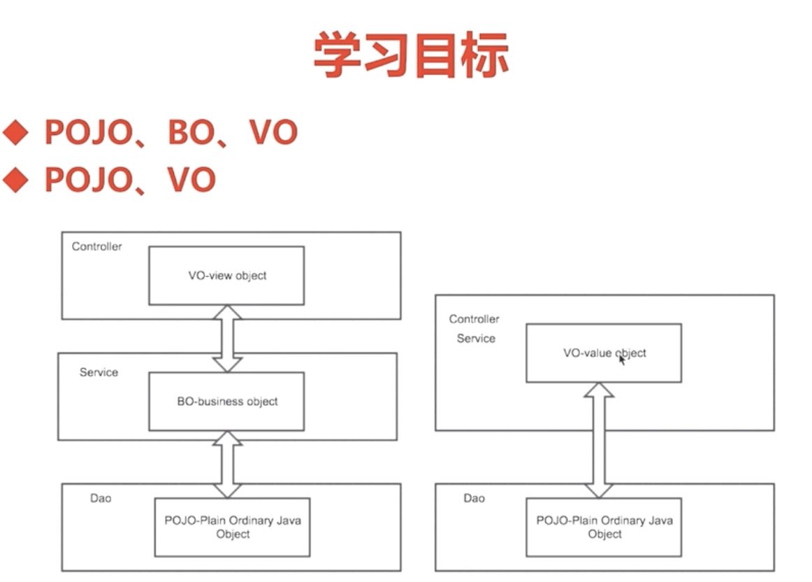

## 7. 开发技巧

### 1. 统一返回对象

​	由于返回一般为 msg, code, data 其中 msg 和 code是通用的

因此:

	1. data 使用 泛型，可以保持任意需要返回的对象
 	2. 使用 static 方法，提供便捷方式（不提供 构造方法)

```java
package com.mmall.common;

import org.codehaus.jackson.annotate.JsonIgnore;
import org.codehaus.jackson.map.annotate.JsonSerialize;

import java.io.Serializable;

/**
 * 通用响应对象
 * @JsonSerialize(include = JsonSerialize.Inclusion.NON_NULL) 用来忽略值为 null的字段 （json序列化后不返回)
 * @param <T>
 */
@JsonSerialize(include = JsonSerialize.Inclusion.NON_NULL)
public class ServerResponse<T> implements Serializable {
    private int status;
    private String msg;
    private T data;

    /* 将构造方法都设置为 private，提供 static 方法供使用 */
    private ServerResponse(int status) {
        this.status = status;
    }

    /* 注意 这个和下面一个方法 的区别
    *
    * ServerResponse(1, new Object()) 会调用该方法
    * ServerResponse(1, "aa") 会调用下面的重载 (精确优先)
    * ==> 如果 data 为 string 类型，则会造成歧义(本来赋值给 data， 结果赋值给了 msg)
    *
    * */
    private ServerResponse(int status, T data) {
        this.status = status;
        this.data = data;
    }

    private ServerResponse(int status, String msg) {
        this.status = status;
        this.msg = msg;
    }

    private ServerResponse(int status, String msg, T data) {
        this.status = status;
        this.msg = msg;
        this.data = data;
    }

    /**
     * 使用 @JsonIgnore, 不序列化 isSuccess 字段
     * @return
     */
    @JsonIgnore
    public boolean isSuccess() {
        return this.status == ResponseCode.SUCCESS.getCode();
    }

    public static <T> ServerResponse<T> createBySuccess() {
        return new ServerResponse<T>(ResponseCode.SUCCESS.getCode());
    }

    public static <T> ServerResponse<T> createBySuccessMessage(String msg) {
        return new ServerResponse<T>(ResponseCode.SUCCESS.getCode(), msg);
    }

    public static <T> ServerResponse<T> createBySuccess(T data) {
        return new ServerResponse<T>(ResponseCode.SUCCESS.getCode(), data);
    }

    public static <T> ServerResponse<T> createBySuccess(String msg, T data) {
        return new ServerResponse<T>(ResponseCode.SUCCESS.getCode(), msg, data);
    }

    public static <T> ServerResponse<T> createByError() {
        return new ServerResponse<T>(ResponseCode.ERROR.getCode(),
                ResponseCode.ERROR.getDesc());
    }

    public static <T> ServerResponse<T> createByErrorMessage(String msg) {
        return new ServerResponse<T>(ResponseCode.ERROR.getCode(),
                msg);
    }

    public static <T> ServerResponse<T> createByErrorCodeMessage(int code, String msg) {
        return new ServerResponse<T>(code, msg);
    }


    public int getStatus() {
        return status;
    }

    public String getMsg() {
        return msg;
    }

    public T getData() {
        return data;
    }
}

```

### 2. 接口做枚举

接口类型 用来定义枚举，相对于使用枚举类型，更加的轻量

```java
public class Const {
    /* 使用 内部接口方式，比枚举更加轻量 */
    public interface Role {
        int ROLE_CUSTOMER = 0; /* 用户 */
        int ROLE_ADMIN = 1; /* 管理员 */
    }
}
```

### 3. StringUtils 工具

用来做 字符串是否为空的判断

```
org.apache.commons.lang3.StringUtils的isBlank isNotBlank
```

### 4. TokenCache

使用 ```com.google.common.cache.LoadingCache``` 来做简单的 token 保存

### 5. MyBatis 分页

1. PageHelper.startPage
2. 创建 PageInfo 对象

```java
@Override
    public ServerResponse<PageInfo> list(Integer userId, int pageNum, int pageSize) {
        PageHelper.startPage(pageNum,pageSize);
        List<Shipping> shippingList = shippingMapper.selectByUserId(userId);
        PageInfo pageInfo = new PageInfo(shippingList);
        return ServerResponse.createBySuccess(pageInfo);
    }
```

### 6. 图片上传 & FTP

### 7. 无限分类 & 查找所有分类

### 8. Mybatis foreach

- 方法

  ```
      int deleteByUserIdProductIds(@Param("userId") Integer userId,@Param("productIdList")List<String> productIdList);
  
  ```

- 查询语句

```
<delete id="deleteByUserIdProductIds" parameterType="map">
    delete from mmall_cart
    where user_id = #{userId}
    <if test="productIdList != null">
      and product_id in
      <foreach collection="productIdList" item="item" index="index" open="(" separator="," close=")">
        #{item}
      </foreach>
    </if>
  </delete>
```

### 9. BigDecimal 做价格计算

BigDecimal 在做价格计算的时候，只有将 Double 转为 String，才能准确

因此，可以提供一个 Utils 类，方便使用

```
public static BigDecimal add(double v1,double v2){
        BigDecimal b1 = new BigDecimal(Double.toString(v1));
        BigDecimal b2 = new BigDecimal(Double.toString(v2));
        return b1.add(b2);
    }
```


## 9. 支付

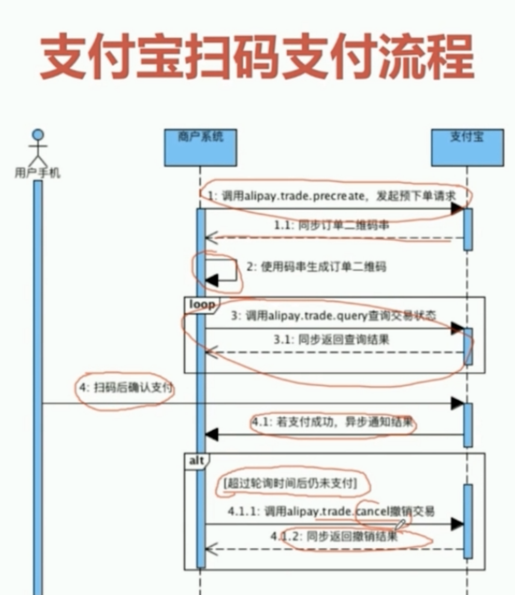

### 10. natapp 进行内网穿透

- 地址

```
https://natapp.cn/
```

#### 1. 购买隧道

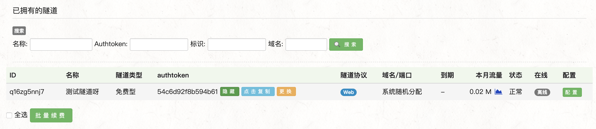

#### 2. 命令行启动

- 下载客户端(mac版)
- 执行

```
chmod +x natapp

// 其中 authtoken 为 隧道对应点 authtoken
./natapp -authtoken=54c6d92f8b594b61
```

- 效果

  其中 红框部分是域名，会将请求转发到 127.0.0.1 的 8080 端口

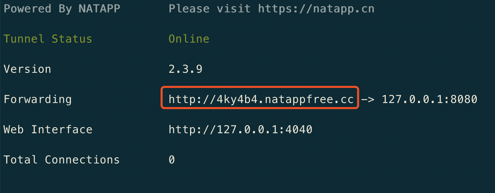

### 12. 云服务器部署

# V2.0

## 1. lombok

通过简单地注解，来消除冗长的代码

1. 可以避免 更改字段名之后，忘记修改 getter setter 方法
2. 支持 @slfj 或 @Log4j方便 logger 使用

### 原理:

Javac 从 Java6开始，就支持了 JSR 269 API 规范

​	==> 只要实现了该 API，就可以在 javac 运行期间得到调用

总结:

​	Lombok 实现了 该API，因此，在 javac 编译源码时，根据使用的注解，自动生成 setter 和 getter 方法

javac 编译流程


### 使用

- maven 引入依赖

```xml
<dependency>
    <groupId>org.projectlombok</groupId>
    <artifactId>lombok</artifactId>
    <version>1.18.10</version>
    <scope>provided</scope>
</dependency>
```

- IDEA 安装 lombok 插件

### 注意点:

​	@Data 注解 包含了

```
 Getter 
 Setter
 RequiredArgsConstructor
 ToString
 EqualsAndHashCode
```

等注解，因此，通常使用 @Getter @Setter 即可

## 2. Maven

### 1. 实际的开发环境

- 本地开发环境 Local
- 开发环境 Dev
- 测试环境 Beta
- 线上环境 Prod

### 2. Maven 环境隔离配置及原理

- pom.xml 中 build 节点增加 resources子节点

```xml
		<resources>
      <!-- 每个环境特有的，放在这里 -->
      <resource>
        <directory>src/main/resources.${deploy.type}</directory>
        <!-- 排除掉 jsp 文件 -->
        <excludes>
          <exclude>*.jsp</exclude>
        </excludes>
      </resource>
      <!-- 公共部分放在这里 -->
      <resource>
        <directory>src/main/resources</directory>
      </resource>
    </resources>
```

- pom.xml 中增加 profiles 节点(与 build 节点同级)

```xml
 <profiles>
    <profile>
      <id>dev</id>
      <!-- 设置默认 -->
      <activation>
        <activeByDefault>true</activeByDefault>
      </activation>
      <properties>
        <deploy.type>dev</deploy.type>
      </properties>
    </profile>
    <profile>
      <id>beta</id>
      <properties>
        <deploy.type>beta</deploy.type>
      </properties>
    </profile>
    <profile>
      <id>prod</id>
      <properties>
        <deploy.type>prod</deploy.type>
      </properties>
    </profile>
  </profiles>
```

测试，点击 Maven， 刷新，将会看到如下结果


- 将需要隔离的文件分开

  由于resources节点中，设置了不同的文件放置目录 src/main/resources.${deploy.type}

  ==> 创建 不同环境对应的文件夹，并且将需要隔离的文件放在这个文件夹下

  

- IDEA 中 设置默认环境

  此处设置的默认环境，指的是 使用 IDEA进行 运行的时候，使用的环境

  

- Maven 环境隔离时，打包命令

```
/*
 参数 -P环境
 -Dmaven.test.skip=true   跳过测试
 */
mvn clean package -Dmaven.test.skip=true -Pdev
```

## 3. Tomcat 集群

### 1. Tomcat 集群能带来什么?

- 提高服务的性能，并发能力，高可用性
- 提供项目架构的横向扩展能力

### 2. Tomcat 集群实现原理

- 通过Nginx 负载均衡进行 转发


### 3. Tomcat 集群带来了什么问题

- session 登录信息存储及读取的问题

  - 解决1

  使用 nginx ip hash policy (上次请求使用哪个，下次还用哪个)

  优点:

  ​	不改变 现有的架构，直接实现横向扩展

  缺点:

  ​	服务器 请求负载 不平均(完全依赖 ip hash的结果)

  ​	在IP变化的环境下无法使用


- 服务器定时任务并发的问题?

### 4. Tomcat 单机部署多应用 

#### 1. 解决Tomcat 乱码的问题

```
修改 conf/sever.xml 文件
添加如下内容
```


#### 2. 确保一个Tomcat 可以正常执行

```
cd bin
chmod +x startup.sh
./startup.sh   
==> 浏览器访问 http://localhost:8080  确保页面正常
```

#### 3. 添加 多个 Tomcat 的环境变量

1. 编辑 /etc/profile 文件，添加下面内容

```
export CATALINA_HOME=/Users/ios/03_software/apache-tomcat-8.5.50
export TOMCAT_HOME=/Users/ios/03_software/apache-tomcat-8.5.50

export CATALINA_2_BASE=/Users/ios/03_software/apache-tomcat-8.5.50-2
export CATALINA_2_HOME=/Users/ios/03_software/apache-tomcat-8.5.50-2
export TOMCAT_2_HOME=/Users/ios/03_software/apache-tomcat-8.5.50-2
```

2. 使得配置生效

```
source /etc/profile
```

#### 4. 修改 第二个 tomcat的配置

- 修改 bin/catalina.sh (mac 下)

  找到 # OS specific support.  $var _must_ be set to  行，添加下面两个内容

  ==> $CATALINA_2_BASE  即环境变量

```
# OS specific support.  $var _must_ be set to either true or false.
export CATALINA_BASE=$CATALINA_2_BASE
export CATALINA_HOME=$CATALINA_2_HOME
```

- 修改 conf/server.xml (该端口)

  共需要修改 3 处端口

  8005 -> 9005

```
><Server port="9005" shutdown="SHUTDOWN">
  <Listener className="org.apache.catalina.startup.VersionLoggerListener" />
  <!-- Security listener. Documentation at /docs/config/listeners.html
  <Listener className="org.apache.catalina.security.SecurityListener" />
```

​		8080 -> 9080

```
<Connector port="9080" protocol="HTTP/1.1"
               connectionTimeout="20000"
               redirectPort="8443" URIEncoding="UTF-8" />
```

​		8009 -> 9009

```
<!-- Define an AJP 1.3 Connector on port 8009 -->
    <Connector port="9009" protocol="AJP/1.3" redirectPort="8443" />
```

#### 5. 修改第二个tomcat 的图标(可选)

为了明显区分两个tomcat，可以修改第二个tomcat的logo

```
替换 webapps/ROOT/tomcat.png 为 其他图片即可
```

#### 6. 分别启动两个tomcat 即可

发现第二个tomcat启动的时候，使用的路径正确，并且logo为我们替换的logo

```
Using CATALINA_BASE:   /Users/ios/03_software/apache-tomcat-8.5.50-2
Using CATALINA_HOME:   /Users/ios/03_software/apache-tomcat-8.5.50-2
Using CATALINA_TMPDIR: /Users/ios/03_software/apache-tomcat-8.5.50-2/temp
```

### 5. Nginx 负载均衡配置

#### 1. 轮询(默认)

- 优点

  实现比较简单

- 缺点

  没有考虑每台服务器的处理能力

  - 配置

    www.happymmall.com => 需要进行负载均衡的 域名

    www.happymmall.com:8080 9090  => 将请求转到哪里

  

#### 2. 权重

- 优点

  考虑了每台服务器处理能力的不同配置

- 配置

  

  其中 8080 权重为15， 9090 权重为10

  ​	==> 8080 被访问到的概率是 9090 的 15/10 倍

#### 3. ip hash

- 优点

  可以实现一个用户访问同一个服务器

- 缺点

  ip hash 不一定均衡

- 配置


#### 4. url hash(第三方)

- 优点

  实现统一服务访问同一个服务器 （根据url区分)

- 缺点

  请求分配会不平均，可能请求频繁的url落到同一个服务器上

#### 5. fair(第三方)

- 特点

  安装后端服务器的响应时间来分配请求，响应时间短的优先进行分配

  

### 6. 搭建集群

- 效果

  浏览器访问 www.day.com, 负载均衡到 www.day.com:8080 www.day.com:9080

#### 1. 启动两个 Tomcat

#### 2. 创建域名

修改 /etc/hosts 文件， 添加如下内容

```
127.0.0.1 www.day.com
```

#### 3. 修改 Nginx 配置

- docker 方式启动Nginx， 并浏览器浏览，确保Nginx 正常
  1. www.day.com 80 的请求，转到 http://www.day.com
  2. 对 www.day.com 做负载均衡，将请求转发到 www.day.com:8080 和 9080上

```
upstream www.day.com
{
    server 本机IP:8080;
    server 本机IP:9080;
}
server {
    listen       80;
    server_name  www.day.com;
    location / {
        proxy_pass http://www.day.com;
    }
}
```

注意：

​	在使用  nginx 的 docker 时，需要将 upstream 中  server 地址使用 本机ip （

由于 www.day.com 是 本机修改 Hosts文件的，在docker内部访问不到这个???)

#### 4. 在浏览器测试即可


## 6. Redis 单点登录

### 1. 单 tomcat 时

```
1. 使用 HttpSession 存储 user 信息
```

问题：

在迁移到 多 tomcat 时，用户在 tomcat1上登录信息 无法同步到 tomcat2上

==> 将 user 信息 存储到 redis ，多个tomcat 都可以连接 Redis 进行获取

### 2. 构建 Redis 连接池

#### 1. Jedis 依赖

```xml
<!-- 与课程使用同样的版本 -->
    <dependency>
      <groupId>redis.clients</groupId>
      <artifactId>jedis</artifactId>
      <version>2.6.0</version>
    </dependency>
```

#### 2. 构件连接池

配置 连接信息, 提供 获取连接，归还连接方法

```java
package com.mmall.common;

import com.mmall.util.PropertiesUtil;
import redis.clients.jedis.Jedis;
import redis.clients.jedis.JedisPool;
import redis.clients.jedis.JedisPoolConfig;
import sun.jvm.hotspot.debugger.win32.coff.COFFFile;

public class RedisPool {
    /* jedis 连接池 */
    private static JedisPool pool;

    /* 最大连接数 */
    private static Integer maxTotal = Integer.parseInt(PropertiesUtil.getProperty("redis.max.total", "20"));

    /* 做多空闲 jedis 实例个数 */
    private static Integer maxIdle = Integer.parseInt(PropertiesUtil.getProperty("redis.max.idle", "10"));

    /* 最小的空闲 jedis 实例个数 */
    private static Integer minIdle = Integer.parseInt(PropertiesUtil.getProperty("redis.min.idle", "2"));

    /**
     * 在 borrow 一个 jedis实例时候，
     * 是否要进行验证操作(true 表示 每次取出来的肯定是可用实例)
     */
    private static Boolean testOnBorrow = Boolean.parseBoolean(PropertiesUtil.getProperty("redis.test.borrow", "true"));

    /**
     * 在 return 一个实例的时候，进行验证
     * 如果为 true，表示 放入的一个实例肯定是可用的
     */
    private static Boolean testOnReturn = Boolean.parseBoolean(PropertiesUtil.getProperty("redis.test.return", "true"));

    private static String redisIp = PropertiesUtil.getProperty("redis.ip");
    private static Integer redisPort = Integer.parseInt(PropertiesUtil.getProperty("redis.port"));


    private static void initPool() {
        JedisPoolConfig config = new JedisPoolConfig();
        config.setMaxTotal(maxTotal);
        config.setMaxIdle(maxIdle);
        config.setMinIdle(minIdle);
        config.setTestOnBorrow(testOnBorrow);
        config.setTestOnReturn(testOnReturn);
        /**
         * 连接耗尽的时候，有新的连接来临
         *  true: 阻塞 直到超时 或者可用
         *  fale：抛出异常
         */
        config.setBlockWhenExhausted(true);

        pool = new JedisPool(config, redisIp, redisPort, 1000 * 2);
    }

    static {
        initPool();
    }

    /**
     * 获取一个 Jedis 连接
     * @return
     */
    public static Jedis getJedis() {
        return pool.getResource();
    }

    public static void returnResource(Jedis jedis) {
        pool.returnResource(jedis);
    }

    public static void returnBrokenResource(Jedis jedis) {
        pool.returnBrokenResource(jedis);
    }

    public static void main(String[] args) {
        Jedis jedis = RedisPool.getJedis();
        jedis.set("sssss", "aaaa");
        RedisPool.returnResource(jedis);
    }
}

```

#### 3. Redis工具类

包含操作 Redis 常用的一些方法

- set
- get
- setEx
- expire
- del

```java
package com.mmall.util;

import com.mmall.common.RedisPool;
import lombok.extern.slf4j.Slf4j;
import org.slf4j.LoggerFactory;
import redis.clients.jedis.Jedis;

@Slf4j
public class RedisPoolUtil {

    /**
     * 设置 key 的超时时间
     * @param key
     * @param exTime 单位 秒
     * @return 1 -> 成功
     */
    public static Long expire(String key, int exTime) {
        Jedis jedis = null;
        Long result = null;

        try {
            jedis = RedisPool.getJedis();
            result = jedis.expire(key, exTime);
        } catch (Exception e) {
            log.error("expire key: {}  error", key, e);
            RedisPool.returnBrokenResource(jedis);
            return result;
        }
        RedisPool.returnResource(jedis);
        return result;
    }

    /**
     * 设置 带有 超时时间的 key
     * @param key
     * @param value
     * @param exTime
     * @return
     */
    public static String setEx(String key, String value, int exTime) {
        Jedis jedis = null;
        String result = null;

        try {
            jedis = RedisPool.getJedis();
            result = jedis.setex(key, exTime, value);
        } catch (Exception e) {
            log.error("setex key: {} value: {} error", key, value, e);
            RedisPool.returnBrokenResource(jedis);
            return result;
        }
        RedisPool.returnResource(jedis);
        return result;
    }

    /**
     * 设置 Key value
     * @param key
     * @param value
     * @return
     */
    public static String set(String key, String value) {
        Jedis jedis = null;
        String result = null;

        try {
            jedis = RedisPool.getJedis();
            result = jedis.set(key,value);
        } catch (Exception e) {
            log.error("set key: {} value: {} error", key, value, e);
            RedisPool.returnBrokenResource(jedis);
            return result;
        }
        RedisPool.returnResource(jedis);
        return result;
    }

    /**
     * 获取key的值
     * @param key
     * @return
     */
    public static String get(String key) {
        Jedis jedis = null;
        String result = null;

        try {
            jedis = RedisPool.getJedis();
            result = jedis.get(key);
        } catch (Exception e) {
            log.error("get key: {} error", key, e);
            RedisPool.returnBrokenResource(jedis);
            return result;
        }
        RedisPool.returnResource(jedis);
        return result;
    }

    /**
     * 删除 key
     * @param key
     * @return
     */
    public static Long del(String key) {
        Jedis jedis = null;
        Long result = null;

        try {
            jedis = RedisPool.getJedis();
            result = jedis.del(key);
        } catch (Exception e) {
            log.error("del key: {} error", key, e);
            RedisPool.returnBrokenResource(jedis);
            return result;
        }
        RedisPool.returnResource(jedis);
        return result;
    }


    public static void main(String[] args) {
        RedisPoolUtil.set("k1", "v1");
        String k1 = RedisSharedPoolUtil.get("k1");
        RedisSharedPoolUtil.setEx("k2", "v2", 100);
        RedisSharedPoolUtil.expire("k2", 2000);
        RedisSharedPoolUtil.del("k1");
    }
}


```


#### 4. Json序列化工具

由于 在 Redis 中 进行操作的时候，使用的都是 String。而 需要保存到 Redis 的是对象

因此，在 set 的时候，需要将对象进行序列化， 在 取出的时候，需要进行 反序列化

注意：

> 在 string 转 obj 的时候
>
> ​	string2Obj(String str, Class<T> clazz) 对于 普通类型是正常的，但是对于 List<User> 这种复合类型，则会出错	

```java
package com.mmall.util;

import com.mmall.pojo.User;
import lombok.extern.slf4j.Slf4j;
import org.apache.commons.lang3.StringUtils;
import org.codehaus.jackson.JsonParseException;
import org.codehaus.jackson.map.DeserializationConfig;
import org.codehaus.jackson.map.JsonMappingException;
import org.codehaus.jackson.map.ObjectMapper;
import org.codehaus.jackson.map.SerializationConfig;
import org.codehaus.jackson.map.annotate.JsonSerialize;
import org.codehaus.jackson.type.JavaType;
import org.codehaus.jackson.type.TypeReference;

import java.io.IOException;
import java.text.SimpleDateFormat;
import java.util.Arrays;
import java.util.List;

/**
 * 由于存储到 Redis时，使用的是 String
 * 因此，就需要 JsonUtil 来做 obj => string 或者 string => obj
 */
@Slf4j
public class JsonUtil {

    private static ObjectMapper objectMapper = new ObjectMapper();

    static {
        /* 序列化时，所有的字段全部列入 */
        objectMapper.setSerializationInclusion(JsonSerialize.Inclusion.ALWAYS);
        /* 取消 时间 默认转换 timestamp 形式 */
        objectMapper.configure(SerializationConfig.Feature.WRITE_DATES_AS_TIMESTAMPS, false);
        /* 忽略 空 bean 转 json 错误 */
        objectMapper.configure(SerializationConfig.Feature.FAIL_ON_EMPTY_BEANS, false);
        /* 所有的时间格式都统一下面的形式 */
        objectMapper.setDateFormat(new SimpleDateFormat(DateTimeUtil.STANDARD_FORMAT));

        /* 忽略 在 json字符串中存在，但是 java对象中不存在对应属性的情况，防止错误 */
        objectMapper.configure(DeserializationConfig.Feature.FAIL_ON_UNKNOWN_PROPERTIES, false);

    }

    public static <T> String obj2String(T obj) {
        if (obj == null) {
            return null;
        }

        try {
            return obj instanceof String ? (String)obj: objectMapper.writeValueAsString(obj);
        } catch (Exception e) {
            log.warn("Parse object to String error", e);
            return null;
        }
    }

    public static <T> String obj2StringPretty(T obj) {
        if (obj == null) {
            return null;
        }

        try {
            return obj instanceof String ? (String)obj: objectMapper.writerWithDefaultPrettyPrinter().writeValueAsString(obj);
        } catch (Exception e) {
            log.warn("Parse object to String error", e);
            return null;
        }
    }

    /**
     * 通用的 字符串 转 具体类型
     * @param str
     * @param tTypeReference
     * @param <T>
     * @return
     */
    public static <T> T string2Obj(String str, TypeReference<T> tTypeReference) {
        if (StringUtils.isEmpty(str) || tTypeReference == null) {
            return null;
        }

        try {
            return (T) (tTypeReference.getType().equals(String.class) ? str : objectMapper.readValue(str, tTypeReference));
        } catch (IOException e) {
            log.warn("Parse String to Objet error", e);
            return null;
        }
    }

    public static <T> T string2Obj(String str, Class<T> collectionClass,
                                   Class<?>... elementCLasses) {
        JavaType javaType = objectMapper.getTypeFactory().
                constructParametricType(collectionClass, elementCLasses);

        try {
            return objectMapper.readValue(str, javaType);
        } catch (Exception e) {
            log.warn("Parse String to Object error", e);
            return null;
        }
    }

    /**
     * 有问题的反序列化方法 如果 类型是 List<<User>> 则序列化错误
     * @param str
     * @param clazz
     * @param <T>
     * @return
     */
    public static <T> T string2Obj(String str, Class<T> clazz) {
        if (StringUtils.isEmpty(str) || clazz == null) {
            return null;
        }

        try {
            return clazz.equals(String.class) ? (T)str : objectMapper.readValue(str, clazz);
        } catch (IOException e) {
            log.warn("Parse String to Objet error", e);
            return null;
        }
    }

    public static void main(String[] args) {
        User u1 = new User();
        u1.setId(1);
        u1.setUsername("aaa");

        User u2 = new User();
        u2.setId(2);
        u2.setEmail("111.com");

        String s = JsonUtil.obj2String(u1);
        String s1 = JsonUtil.obj2StringPretty(u1);

        User user = JsonUtil.string2Obj(s, User.class);

        System.out.println(user);

        List<User> users = Arrays.asList(u1, u2);

        String s2 = JsonUtil.obj2String(users);

        List<User> users1 = JsonUtil.string2Obj(s2, new TypeReference<List<User>>() {
        });
        System.out.println(users1);

        List list = JsonUtil.string2Obj(s2, List.class, User.class);

    }
}

```

#### 5. 登录，验证的时候，从cookie中取出 token，根据token从Redis中取出具体对象

为什么要使用 cookie, 而不使用 HttpSession 的 id

```
由于 HttpSession 是 tomcat 相关的。
1. 第一次浏览器请求是，没有任何信息，则服务端会生成一个 名为 JSESESSIONID 的 Cookie，
2. 请求第二次到达的时候，服务端 根据 JSESESSIONID 的 cookie 查找 对应的 Session， 如果找不到，重新创建
==> 请求在第一个 tomcat 上 登录，返回了一个 JSESESSIONID，但是在第二个 tomcat 请求是，找不到 对应session，就会重新创建一个。导致 两个 tomcat 上信息不能同步
```

#### 6. 忘记密码等 token 存储在 GuavaCache 迁移到 Redis

### 7. Redis分布式算法

在使用 Redis 分布式的时候，应该按照什么策略 存储 + 读取 数据呢?

#### 传统的算法

```
假定有 4个 Redis 节点，现在有 20个 图片需要处理
1. hash(图片1) % 4 = 存储的 Redis 节点id
```


这种算法有什么问题呢?

```
如果 增加了一个 Redis 节点。那么原来存储的数据，在读取的时候，hash(图片) % 5 会导致 命中率 特别低。。。
如下图所示，原来存储的 20个数据，只有 4个数据会命中，其他的都失败.....
```


那么，有什么算法 可以再 增减Redis 配置的时候，也很合适呢?

#### Consistent hashing 算法

即 一致性 hash 算法

1. 首先，有一个环形 hash 空间，即 hash 的结果是一个环(值得取值范围是 0-2^32-1)


2. 使用一个 hash 算法，将 每个 Redis 的信息，计算出一个 hash 值
3. 使用同样的hash算法，将 要存储的数据 计算出 hash值

>如图，其中:
>
>​	蓝色 3个点 => Redis 节点 hash 结果
>
>​	红色点        => 要存储的 数据  hash 结果


存储原则:

	> 顺时针方向，红色点存储在 遇到的第一个 蓝色点上

```
这样的存储方式，在增加，删除 Redis 节点的时候，数据 影响比较小
```

=================

这种 算法 有什么 缺点吗 ？

##### Hash 倾斜性问题

嗯嗯~ ，如果 Redis 节点 计算出的 hahs 结果是下面这种情况，那么 有的 Redis 节点 很繁忙，而有的则无事可做

> Hash 倾斜性  A B C 3个 Redis 节点的 hash 结果不均匀。。。导致 A 节点上存储数据较多，BC 节点基本无事可做


==============================

这种问题如何解决呢？

##### 虚拟节点方式

```
使用 虚拟节点的方式
  本来只有 ABC 3个真实节点，但是这 3个 节点 hash 不均匀，
  那么，可以使用算法，对真实节点 虚拟出很多的 虚拟节点，需要存储的数据落在 虚拟节点上 == 存储在真实节点上
  如果虚拟节点更多，那么 分布就更加均匀
```


### 8. Redis 分布式搭建

修改 Redis 配置文件，改为两个端口，然后启动两个Redis 即可

### 9. 代码使用 Redis 分布式

现在有了 多个 Redis 节点，如何在 代码中使用呢

===========

Sharded Jedis API

### 10. Spring Session 简介

> Spring Session 提供了一套 创建 和 管理ServletHttpSession的方案

> 提供了集群Session的功能
>
> ​	默认采用了 外置的 Redis 来存储 Session数据，
>
> 并以此来解决Session共享的问题

### 11. SpringMVC全局异常

没有SpringMVC异常的时候，流程是什么样子的呢?


那么，加入了SpringMVC 全局异常之后呢?


